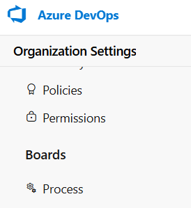
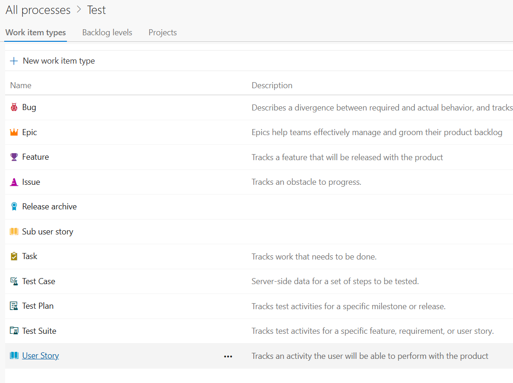
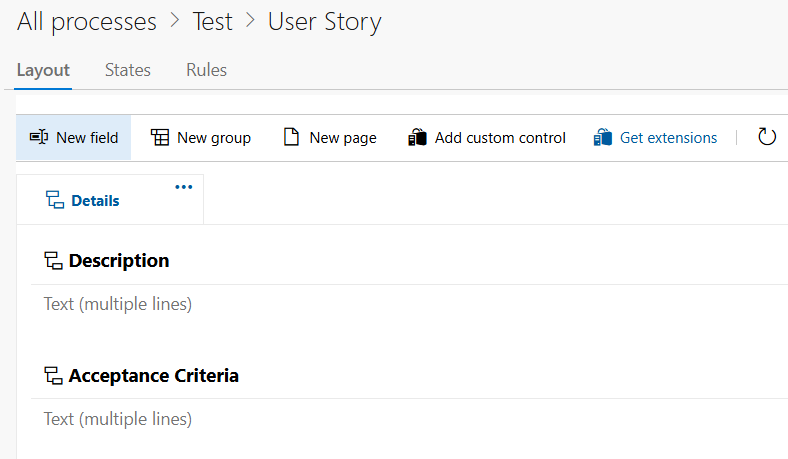
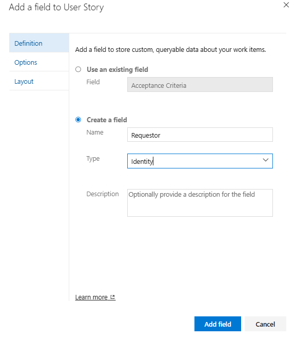
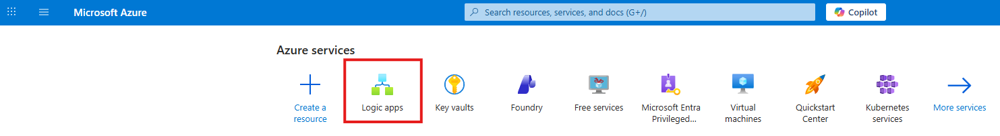
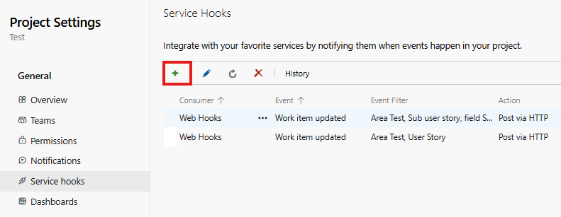

# Setup Guide

When working with user stories in Azure DevOps, one recurring problem was keeping the original requestor informed once their requirement had been deployed to the acceptance environment.

Before this automation was in place, the update was manual. Someone from the team had to remember to tag or message the requestor after deployment. That worked, but only as long as nobody forgot. It also meant the process depended too much on individual discipline instead of the workflow itself.

To remove that manual step, I built a small notification flow using Azure DevOps Service Hooks and Azure Logic Apps.

The idea is straightforward:

- a user story is updated in Azure DevOps
- Azure DevOps sends the update to a Logic App through a webhook
- the Logic App checks the current state
- if the state is changed from A to B, an email is automatically sent to the requestor

This guide explains how the setup was done.

---

## Add the requestor field

The first thing needed was a way to identify who should receive the notification.

In Azure DevOps, I added a field on the work item to store the requestor’s email address. This can be a custom field if your process does not already include one.

To do that:

- go to **Organization settings**

- select **Process**

- select the process that your project is using

- select the work item type, in my case are user stories and sub user stories

- select **New Field**

- name the field and select type as **Identity**

Once this field exists, make sure it is filled in when the item is created. Without it, the Logic App has nobody to notify.

---

## Create the Logic App

Next, I created the workflow in Azure.

In the Azure portal (portal.azure.com):

- create a new **Logic App**

- select your subscription, resource group, and location
- be careful when naming your logic app since you cannot change it later
- after the app is created, open the **Logic app designer** under Development Tools

- choose **When an HTTP request is received** as the trigger
- select **Save**
- after saving the Logic App once, Azure generates an HTTP POST URL, copy this URL

---

## Connect Azure DevOps with the Logic App

In Azure DevOps:

- go to your project and select **Project settings**
- open **Service hooks** and create a new one

- select *Web hook*

- select the event **Work item updated**

- in the webhook action, paste the HTTP POST URL generated by the Logic App.

With the Logic App ready, the next step was to make Azure DevOps call it automatically.

From that point on, every time a work item is updated, Azure DevOps sends the event payload to the Logic App.

---

## Configure the incoming payload

Since the Logic App receives JSON from Azure DevOps, it needs to understand the structure of the data.

Inside the trigger, use the option to generate the schema from a sample payload. The important fields to capture are:

- the current state of the work item
- the requestor email
- the work item title

Once the schema is in place, these values become available as dynamic content inside the workflow.

---

## Add the condition for deployment

The main piece of logic is the state check.

I added a condition that checks whether the work item state equals the deployment state I care about, for example:

`System.State = Deployed to A`

If the condition is true, the workflow continues to the email step. If not, it does nothing.

This keeps the flow simple and makes the purpose obvious when someone opens the Logic App later.

*(Add screenshot here)*

---

## Send the email

Inside the **True** branch of the condition, I added the Outlook action:

**Send an email from a shared mailbox (V2)**

The recipient is the requestor email from the work item.

The subject and body can be kept simple. For example, the email can mention:

- the title of the user story
- that it has been deployed to the acceptance environment
- a link back to the Azure DevOps item

That is enough to make the update useful without overcomplicating the template.

---

## Test the flow

To verify the setup:

- open a user story
- change the state to `Deployed to A`
- save the item

If everything is configured correctly:

- Azure DevOps sends the webhook
- the Logic App receives it
- the condition matches
- the requestor gets the email

---

## Final note

This solution was built to remove one small but repetitive manual task from backlog management.

It is intentionally simple. The workflow checks the current state and sends the email when the item reaches the target stage. That was enough to solve the original problem: making sure requestors are notified when their requirement is deployed to the acceptance environment, without relying on someone to remember to tag them manually.
